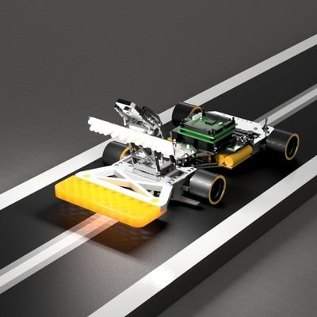
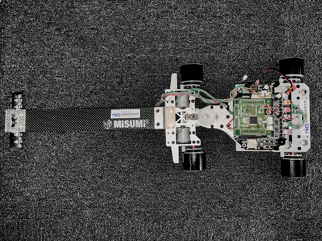

# 私たちマイコン技術研究会について
ページは現在作成中です。  
  
fig.1 人工網膜センサーを使用したマイコンカー(This CG make of Fusion360)  

マイコンを使用したものづくりを行う団体のNiAS MCR研究会です。  
楽しいものづくりを目指しいている団体です。  
  
連絡についてはTwitterのDMへ  
(アカウントへのフォローをお願いします。スパム対策でフォロー外は連絡できなくしています)  

## 作成したマイコンカーが動くところ
! [人工網膜センサーを使用したカメラマイコンカーの走行動画(http://img.youtube.com/vi/YOUTUBE_VIDEO_ID_HERE/0.jpg)](https://youtu.be/YGCIjlACJ_s)  

## SNS  
- Twitter：[@nias_mcr](https://twitter.com/nias_mcr)  
- Youtube：[youtubeチャンネル](https://www.youtube.com/channel/UCPb_9_xRmYvkob2SgeWoP0g)  
- ニコニコ動画：[ユーザーページ](https://www.nicovideo.jp/user/86514801)

## Githab(設計図共有サイト)  
- Githubアカウント：[アカウントページ](https://github.com/NiASMCR)    

- 公開に向け準備中のもの  
・水中ロボコンのジュニア部門に出場する中・高校生に向けたデータ(投稿予定)    

・CADデータ公開のマイコンカー  
  
fig.2 公開に向けて開発中のマイコンカー

## 過去の活動  
### 高校生の大会(JMCR)の県・地区大会同一レイアウトでの実施  
- 造大祭2021 記録会  
- 造大祭2022 記録会・技術交流会：[ホームページのリンク](https://sites.google.com/campus.nias.ac.jp/nias-mcr-2022/%E3%83%9B%E3%83%BC%E3%83%A0)  
### 応募した企画
- Autodesk社#みんなで作るFusion360 PVプロジェクト 応募→採用(0:14あたりに掲載)  
  
### その他の過去の活動  
・青少年のための科学の祭典  
・造大祭にて、ミニマイコンカー組み立て→コースを走らせるまでの体験会の実施   
・JMCR2020全国大会スタッフ(車検)  

## 個別の過去の表彰歴  
- 2020  
  全日本マイコンカーラリー2020  
    GR-Peach部門 GR-Peach賞  
    Advanced Class車体部門 8位+特別賞  
- 2019  
  第5回福岡県マイコンカーラリー技術交流大会　兼　西工大杯マイコンカーラリー2019西日本大会  
    GR-Peach画像処理Class 第3位  
- 2015  
  2015年度マイコンカーラリー競技会＆技術交流会  
    Advanced Class車体部門 51位  
    Advanced Class車体部門 特別賞  

各種データの共有、情報の共有を目指し、作成中です。
